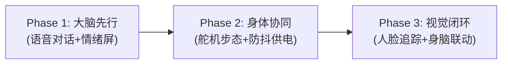

# 《复苏计划》(Recovery-Plan)

> **基于 ESP32-S3 与 STM32F103 的智能交互拟四足桌面伴侣机器人**  
> *"由两位嵌入式初学者发起，旨在通过工程实践跑通端侧大模型、实时步态运动学与多模态感知的完整闭环。"*

[](https://opensource.org/licenses/MIT)
[](https://github.com/lllaaa999/Recovery-Plan)
[](https://github.com/lllaaa999/Recovery-Plan)

---

## 📌 项目愿景与背景

《复苏计划》是一个面向桌面陪伴场景的**智能拟四足机械狗（桌宠）**开源项目。  
项目围绕**“身脑协同”**的分层架构展开：
* **大脑（上位机·认知与感知）**：采用 **ESP32-S3-CAM（N16R8）**，负责接入 Wi-Fi、运行小智 AI 端侧语音大模型固件、I2S 全双工语音对话、OLED 动态表情驱动，并通过加长版广角摄像头实现视觉识别与人脸追踪。
* **身体（下位机·运动与执行）**：采用 **STM32F103C8T6** 最小系统板，负责四足逆运动学（Inverse Kinematics）步态解算、4路 SG90 微型舵机 PWM 驱动，并通过串口接收大脑下达的高级行为指令。

---

## 🛠️ 系统架构与拓扑

```
                           【 外部交互 / 云端生态 】
                                      │  (Wi-Fi / WebSocket)
                                      ▼
                        ┌───────────────────────────┐
                        │   ESP32-S3-CAM (N16R8)    │
                        │       【大脑中枢】        │
                        │  - 小智 AI 语音大模型交互 │
                        │  - 0.96" OLED 动态情绪表情│
                        │  - OV2640 广角视觉与追踪 │
                        └─────────────┬─────────────┘
                                      │  UART 串口双向通信
                                      │  (波特率: 115200)
                                      ▼
                        ┌───────────────────────────┐
                        │      STM32F103C8T6        │
                        │       【身体控制】        │
                        │  - 四足逆运动学步态解算   │
                        │  - 4 路高精度硬件 PWM 输出│
                        └─────────────┬─────────────┘
                                      │  PWM 控制脉冲 (50Hz)
                                      ▼
                        ┌───────────────────────────┐
                        │   4× SG90 微型机械关节    │
                        └───────────────────────────┘
```

---

## 🔋 供电系统与防死机拓扑（核心避坑）

四足机器人最常见、也是最致命的硬件故障是：**舵机启动瞬态抽流（高达 2A~3A）导致电源电压跌落（Brownout），引发 MCU 频繁死机重启**。本项目采用**大电流同步升压 + 储能电容**方案彻底解决该问题：

```
[ 3.7V 2500mAh 5C动力锂电池 (带板) ]
             │
[ Type-C 5V 3A 大电流同步升压充放电板 (FP6277 / FP6296) ]
             │
             ├──【 5V 舵机动力支路 】
             │        │
             │        ├── 并联 [ 1000µF/16V 低 ESR 电解电容 ] (吸收起步大浪涌)
             │        └── 供电至 4× SG90 舵机 VCC
             │
             └──【 5V 逻辑/音频支路 】(单点接地隔离，消除高频电机噪声)
                      │
                      ├── ESP32-S3-CAM 供电端
                      │      ├── I2S IN  <-- INMP441 全向麦克风 (带减震泡棉)
                      │      ├── I2S OUT --> MAX98357A 功放 --> 2030 音腔小喇叭
                      │      ├── I2C BUS --> 0.96" SSD1306 OLED 屏
                      │      └── DVP FPC <-- OV2640 75mm 24Pin 120° 广角摄像头
                      │
                      └── STM32F103 供电端
                             └── 串口 TX/RX 互连至 ESP32-S3
```

---

## 📦 物料清单与预算概览 (BOM Summary)

整套方案经过精心剪枝与实测优化，**砍掉了昂贵臃肿的外部高价视觉板**，结合深圳原厂供应链现货后，将总预算进一步压缩至 **155 - 170 元（人民币）左右**：

| 子系统 | 核心物料 | 推荐型号/规格 | 数量 | 参考预算 (元) |
|---|---|---|---|---|
| **大脑与眼睛** | ESP32-S3-CAM | N16R8 (16MB Flash + 8MB PSRAM) + Type-C | 1 | 45 元 |
| **加长视界** | 加长排线摄像头 | OV2640 75mm 24Pin 0.5mm 120°广角 | 1 | 10 元 |
| **身体控制** | STM32 核心板 | STM32F103C8T6 最小系统板 (72MHz) | 1 | 15 元 |
| **烧录工具** | 仿真下载器 | ST-Link V2 下载器 | 1 | 12 元 |
| **耳朵** | 数字麦克风 | INMP441 I2S 全向采集模块 (信泰微等) | 1 | 4.1 元 |
| **嘴巴** | 数字功放 | MAX98357A I2S 功放 (带 PH1.25 端子防飞线版) | 1 | 8.8 元 |
| **声音发声** | 腔体喇叭 | 2030 密封小音腔喇叭 (4Ω 3W) | 1 | 2.2 元 |
| **情绪屏幕** | OLED 屏 | 0.96 寸 SSD1306 (4Pin I2C 接口) | 1 | 9 元 |
| **机械动力** | 微型舵机 | SG90 9g 微型舵机 (塑料/尼龙齿，建议买5个) | 4 | 18 元 |
| **骨架结构** | 3D打印件 | 米士古开源腿 STL (高韧性树脂/PLA) | 1套 | 35 元 |
| **稳固供电** | 大电流升压板 | 5V 3A 同步升压板 (认准 FP6277 / FP6296) | 1 | 10 元 |
| **动力源** | 动力锂电池 | 18650 动力锂电 2500mAh (5C/8C 带保护板) | 1 | 11 元 |
| **抗浪涌电容**| 储能电解电容 | 1000µF / 16V 低 ESR 电解电容 | 2 | 1 元 |
| **柔性配线** | 特软硅胶线 | 28AWG 多股特软硅胶线 | 1套 | 8 元 |
| **合计** | - | - | - | **约 169 元 (RMB)** |

> 详细选购指引与参数确认请参阅：[docs/hardware/BOM.md](docs/hardware/BOM.md)

---

## 🚀 分阶段实施路线图 (Roadmap)

本项目采用模块化分解开发，将工程拆分为三个逐步推进的里程碑：



1. **Phase 1（语音与大脑）**：
   * 调通 ESP32-S3 小智固件、Wi-Fi 配网与大模型流式对话。
   * 调通 INMP441 录音与 MAX98357A 腔体音频播放，消除底噪。
   * 调通 0.96" OLED I2C 表情渲染。
2. **Phase 2（运动与骨架）**：
   * 完成 3D 打印件装配与 4 个 SG90 舵机初始中位对准。
   * 搭建 STM32 最小工程，编写 4 足前进、转向、打招呼步态。
   * 接入 5V 3.5A 升压板与 1000µF 储能电容，压力测试确保剧烈摆腿不掉电。
3. **Phase 3（视觉与协同）**：
   * 接入 OV2640 75mm 加长广角摄像头，完成脖子走线。
   * 调通人脸定位坐标提取，通过串口将坐标发给 STM32，实现小狗头部跟随。

---

## 📚 目录与固件源码导航

### 1. 核心技术文档
* 📑 [完整物料清单与采购指南 (BOM)](docs/hardware/BOM.md)
* 🛒 [最终采购清单勾选单 (Checklist Markdown)](docs/hardware/PURCHASE_CHECKLIST.md) / [📥 Excel表格下载 (CSV)](docs/hardware/PURCHASE_CHECKLIST.csv)
* 🔌 [引脚分配与电路连线图 (Wiring & Pinout)](docs/hardware/WIRING_AND_PINOUT.md)
* ⚠️ [硬件避坑红宝书 (Hardware Pitfalls)](docs/hardware/HARDWARE_PITFALLS.md)
* 💻 [身脑通信协议与软件架构 (Software Architecture)](docs/software/ARCHITECTURE.md)
* 📋 [项目详细实施规划 (Implementation Plan)](docs/roadmap/IMPLEMENTATION_PLAN.md)

### 2. 固件工程与控制源码
* 🐕 [STM32F103 下位机身体控制源码 (PlatformIO / Keil)](firmware/stm32f103/README.md)
  * 4 路 SG90 舵机 50Hz 硬件 PWM 驱动 + 防扫齿平滑插值插补
  * 对角小跑 (Trot)、原地踏步转向、打招呼、视线闭环跟随步态
  * `$ACT,...#` 与 `$TRACK,...#` 身脑协议解析器
* 🧠 [ESP32-S3-CAM 大脑中枢与小智 AI 适配](firmware/esp32-s3/README.md)
  * 小智 AI 固件自定义引脚适配表 (`xiaozhi_custom_pins.json`)
  * 大模型语音动作意图调度器 (`action_dispatcher`)
  * OV2640 120° 广角人脸抓取与视线偏差提取独立测试工程 (`vision_tracker`)
* ⚡ [一键固件烧录工具库 (Tools)](tools/)
  * `flash_esp32.bat`：ESP32-S3 固件一键烧录脚本
  * `flash_stm32.bat`：STM32 ST-Link 一键烧录脚本

---

## 👥 开发团队
* **项目代号**：《复苏计划》(Recovery-Plan)
* **开发者**：lllaaa999 及 团队成员
* **协议**：MIT License
