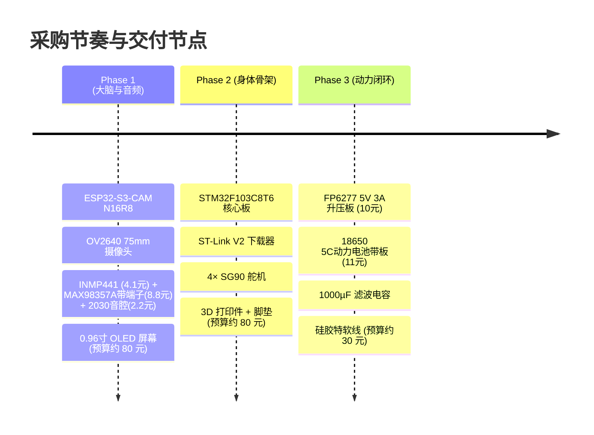

# 详细物料清单与采购选型指南 (BOM)

本文档列出了《复苏计划》拟四足桌宠机器人的完整硬件物料清单、选型理由、避坑指标与采购建议。

---

## 📋 完整物料汇总表

| 序号 | 类别 | 物料名称 | 规格型号 / 核心指标 | 数量 | 预估单价 (元) | 用途 / 选型理由与推荐店铺 |
|---|---|---|---|---|---|---|
| 1 | 主控 | **ESP32-S3-CAM 开发板** | **N16R8** (16M Flash + 8M PSRAM), Type-C 接口 | 1 | 45 元 | **大脑与眼睛核心**：运行小智 AI 语音固件、大模型对接、人脸识别推理。 |
| 2 | 视觉 | **加长版 OV2640 摄像头** | **75mm 长度**，24Pin 0.5mm 间距，**120° 广角** | 1 | 10 元 | **眼睛视界**：从腹部穿过脖子到达头部，广角镜头抓脸范围大。 |
| 3 | 下位机 | **STM32F103C8T6 最小系统板** | 72MHz 主频，Cortex-M3，Type-C/Micro 均可 | 1 | 15 元 | **身体控制**：专门负责 4 路舵机 PWM 发生与逆运动学步态解算。 |
| 4 | 工具 | **ST-Link V2 下载器** | 铝合金外壳迷你版 (带 4Pin 杜邦线) | 1 | 12 元 | STM32 固件烧录与 SWD 硬件仿真调试。 |
| 5 | 音频 | **INMP441 数字麦克风** | I2S 全向数字麦克风模块 (深圳信泰微电子现货) | 1 | 4.1 元 | 高信噪比数字麦克风，直出 I2S 音频流。搜索词：`INMP441 模块 I2S`。 |
| 6 | 音频 | **MAX98357A I2S 功放** | **推荐带 PH1.25 端子版** (深圳湘橙电子等) | 1 | 8.8 元 | 强烈建议买带端子版，喇叭直插免焊飞线；若买裸板约 3.8 元。搜索词：`MAX98357A I2S 功放`。 |
| 7 | 音频 | **2030 密封腔体小喇叭** | **4Ω 3W**，带密封塑料音腔 (尺寸 20×30mm) | 1 (建议买2备用) | 2.2 元 | 正好塞进狗头腔体，带音腔声音厚实不破音。搜索词：`2030 音腔喇叭 4欧3W`。 |
| 8 | 显示 | **0.96寸 I2C OLED 屏幕** | SSD1306 驱动，128×64 分辨率，4Pin 接口 | 1 | 9 元 | 脸部情绪交互，显示眨眼、思考、开心、生气等表情。 |
| 9 | 运动 | **SG90 9g 微型舵机** | 180° 旋转，塑料/尼龙齿轮（建议买 5 个备用） | 4 (+1备用) | 4.5元/个 (共18~22元) | 四足四自由度腿部关节，极高性价比，自重轻，适合初学桌面级验证。 |
| 10 | 结构 | **米士古开源腿 3D 打印件** | 包含 4 条腿部骨架与底板 (PLA 或 高韧树脂) | 1套 | 35 元 | 机械狗机身骨架（淘宝代打或自打）。 |
| 11 | 结构 | **3M 半球形橡胶脚垫** | 直径 8mm~10mm，带背胶 | 4 | 2 元 | 贴在四条腿脚底，防止在光滑桌面上打滑。 |
| 12 | 供电 | **大电流同步升压板 (FP6277 / FP6296)** | **5V 3A 同步升压** (必须认准 FP6277 或 FP6296) | 1 | 10 元 | **核心避坑纠错**：原 FP6276 额定仅 2A 会因 4 舵机抽流跳闸，必须选 FP6277 5V 3A 方案！搜索词：`FP6277 升压模块 5V 3A`。 |
| 13 | 电池 | **18650 动力锂电池 (带保护板)** | **3.7V 2500mAh 5C/8C 高倍率动力电芯** | 1 | 11 元 | 认准 5C/8C 动力型（持续放电 12.5A+），绝不买容量型慢放电电池。搜索词：`18650 动力 2500mAh 带保护板`。 |
| 14 | 滤波 | **低 ESR 铝电解电容** | **1000µF / 16V** 或 2200µF / 10V | 2 | 1 元 | 并联在舵机 5V 母线，充当蓄水池平抑抽流浪涌。 |
| 15 | 线材 | **28AWG 硅胶特软线** | 多股镀锡铜，耐温耐折，红黑黄绿等 | 1卷/套 | 8 元 | 狭窄狗身内走线利器，柔软不卡舵机。 |
| 16 | 辅料 | **洞洞板 / 排针排母** | 5×7cm 玻纤板 + 2.54mm 排针排母 | 1套 | 5 元 | 用于搭建电源分流板与单点接地。 |
| 17 | 辅料 | **EVA 吸音/减震泡棉** | 小块海绵垫 | 1 | 1 元 | 贴在麦克风背面，隔绝机身震动传音。 |

---

## 🔍 关键物料采购认准指标（防买错指南）

### 1. ESP32-S3-CAM 开发板
* **搜索关键词**：`ESP32-S3-CAM N16R8`
* **必认指标**：
  * **必须带 PSRAM**：标注 **N16R8**（16MB Flash + 8MB PSRAM）。跑人脸识别与小智大模型固件若没有 8MB PSRAM 会直接内存不足崩溃。
  * **接口**：认准 **Type-C** 接口（双串口或单串口均可）。

### 2. 加长版 OV2640 摄像头
* **搜索关键词**：`OV2640 75mm 24pin`
* **必认指标**：
  * **长度**：必须选 **75mm（7.5厘米）**。太短够不到狗头，太长（>15cm）高频信号会被电机噪声干扰出现绿条噪点。
  * **间距**：**24 Pin，0.5mm 间距**。
  * **镜头**：优先选择 **120° 广角镜头**，视野大，追踪更容易。

### 3. SG90 舵机
* **搜索关键词**：`SG90 舵机 9g`
* **必认指标**：
  * **规格参数**：标准 9g 尺寸、4.8V~6V 供电、180° 旋转、50Hz PWM 脉冲驱动（0.5ms~2.5ms）。与 MG90S 外形尺寸、安装螺丝孔完全通用。
  * **防扫齿备件建议**：SG90 为塑料/尼龙齿轮，单价极低（仅需 4~5 元），但剧烈撞击或受外力强扭时容易发生齿轮脱齿损坏。**强烈建议一次性购买 5 个（4 个装机 + 1 个备用）**，避免调试中途损坏停工。

### 4. 充放电升压板 (核心纠错：严禁 FP6276 2A，认准 FP6277 3A / FP6296)
* **搜索关键词**：`FP6277 升压模块 5V 3A` 或 `FP6296 升压板`
* **必认指标**：
  * **芯片电流辨析**：查阅官方数据手册，FP6276/FP6276B 标称极限持续能力仅为 **5V 2A (10W)**，而 4 个 SG90 舵机同时起步瞬间峰值达 2.4A+，使用 FP6276 会触发芯片过流限流导致单片机掉电死机！
  * **升级方案**：必须采购 **FP6277（额定 5V 3A）** 或 **FP6296（大功率 8A 开关限流）** 升压模块，保证 5V 动力轨即使四腿剧烈运动也纹丝不动。
  * **严禁购买**：普通 ¥2~¥3 的廉价 IP5306 充电宝小板（带轻载 30s 自动关机陷阱）。

### 5. 18650 动力电池
* **搜索关键词**：`18650 动力 2500mAh 带保护板`
* **必认指标**：
  * **认准倍率**：选用深圳本地厂直供的 **5C 或 8C 动力电芯**（5C 持续放电能力达 12.5A，价格仅约 7~11 元），严禁购买无 C 数标识的普通数码容量型电池。
  * **安全底线**：必须购买**带双 MOS 保护板**版本（防过充、过放、短路）。

### 6. 音频组合（功放+麦克风+腔体喇叭）
* **功放模块**：搜索 `MAX98357A I2S 功放`，推荐多花 5 元选择**带 PH1.25 端子座版**（如湘橙电子等），喇叭端子直接插拔，彻底告别狭小机身内飞线虚焊。
* **麦克风**：搜索 `INMP441 模块 I2S`，选择信泰微电子等深圳现货大店（约 4.1 元）。
* **腔体喇叭**：搜索 `2030 音腔喇叭 4欧3W`（约 2~2.4 元），尺寸 20×30mm 正好嵌入狗头内。

---

## 🎯 分阶段采购策略 (三步走)

